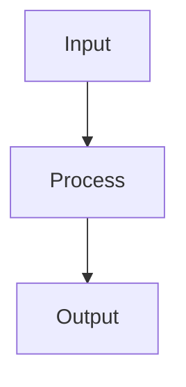

# LynPDF Creator 🐱

**HTML/CSS & Markdown → PDF converter with Thai language support, color emoji, and flexbox layout.**

> **"Lyn"** (pronounced "หลิน" — *Lin*) is the name of a little cat. She inspires this project's goal: creating beautiful PDF documents with graceful simplicity.

---

## Features

- 📄 **HTML + CSS → PDF** — Convert standard HTML/CSS to pixel-perfect PDFs without Headless Browser
- 🇹🇭 **Thai Language** — 20+ Thai font families (Google Fonts + TLWG), word segmentation via `Intl.Segmenter`, stacked vowels/tone marks, and `text-align: justify`
- 🕉️ **Pali / Sanskrit** — Correct rendering of นิคหิต ( ํ ), พินทุ ( ฺ ), ทัณฑฆาต ( ์ ), stacked diacritics via HarfBuzz GSUB/GPOS
- 😀 **Color Emoji** — Full-color Twemoji PNG rendering (auto-downloaded and cached)
- 📐 **Flexbox Layout** — Powered by [Yoga Layout](https://github.com/nicklockwood/yoga) for accurate CSS Flexbox positioning
- 🔡 **OpenType Shaping** — HarfBuzz GSUB (ligatures: fi fl ff) + GPOS (kerning pairs) for all fonts
- 🔤 **Font Support** — TTF, **OTF** (IBM Plex Sans), and **Variable Fonts** (Inter Variable) with automatic weight/style resolution
- 📊 **Tables** — Full HTML tables with `thead` repeat on every page; disable with `-lynpdf-repeat: none`
- 🖼️ **SVG & Images** — Inline SVG vector rendering, `` tags, CSS backgrounds
- 🖨️ **Page Rules** — `@page` margins (pt/px/in/cm/mm), **`@page { size }`** — named sizes (A0–A6, letter, legal, ledger, tabloid), orientation keywords (`landscape` / `portrait`), explicit dimensions (pt/cm/mm/px/in); `counter(page)` / `counter(pages)`, top/bottom headers & footers
- 📋 **PDF Metadata** — Title, Author, Subject, Keywords auto-read from HTML `<meta>` tags
- 🔌 **Dual Interface** — CLI tool or programmatic TypeScript API
- 📦 **NPM Ready** — Publish-ready package with full TypeScript types
- ⚡ **Fast** — Bun runtime, font metric caching, Twemoji PNG caching (~500–700 ms for complex documents)
- 📝 **Markdown → PDF** — Convert `.md` files directly via CLI or API; **syntax highlighting** (highlight.js, 190+ languages), **containers** (`:::info`, `:::warning`, `:::card`), **GitHub Alerts** (`> [!NOTE]`), **color boxes**, GFM tables, task lists, footnotes — with optional Mermaid diagram rendering

## Requirements

| Requirement | Version | Notes |
|-------------|---------|-------|
| **[Bun](https://bun.sh)** | ≥ 1.0 | Recommended runtime — fast, native ESM, built-in TypeScript |
| **Node.js** | ≥ 18 | Alternative runtime; required for `Intl.Segmenter` (th-TH) and native ESM |
| **TypeScript** | ≥ 5.0 | Peer dependency; needed only for type declarations |

> **WebAssembly note:** `harfbuzzjs` (OpenType shaping) and `yoga-layout` (Flexbox engine) ship as **self-contained WASM binaries** bundled inside the npm package. You do **not** need to install system-level `libharfbuzz` or `libyoga`. Bun ≥ 1.0 and Node.js ≥ 18 already ship with WebAssembly support built in — no extra system packages required.

### Runtime Dependencies

Installed automatically by your package manager:

| Package | What it does |
|---------|-------------|
| [`pdfkit`](https://pdfkit.org/) | Core PDF generation library (pure JS) |
| [`yoga-layout`](https://github.com/nicklockwood/yoga) | Meta's CSS Flexbox engine compiled to WASM — no native compile step |
| [`harfbuzzjs`](https://github.com/harfbuzz/harfbuzzjs) | HarfBuzz OpenType shaping compiled to WASM — Thai floating vowels, stacked tone marks, fi/fl ligatures, kerning — **no `libharfbuzz-dev` needed** |
| [`fontkit`](https://github.com/foliojs/fontkit) | TTF/OTF/Variable font parser and glyph metrics (pure JS) |
| [`parse5`](https://github.com/inikulin/parse5) | Spec-compliant HTML5 parser (pure JS) |
| [`css-tree`](https://github.com/csstree/csstree) | CSS parser and AST toolkit (pure JS) |
| [`svg-to-pdfkit`](https://github.com/alafr/SVG-to-PDFKit) | Inline SVG vector rendering (pure JS) |
| [`@twemoji/parser`](https://github.com/jdecked/twemoji) | Color emoji parser; PNGs are fetched from CDN and cached locally on first run |
| [`markdown-it`](https://github.com/markdown-it/markdown-it) | Markdown parser with plugins (GFM tables, footnotes, task lists, custom containers) |
| [`highlight.js`](https://highlightjs.org/) | Syntax highlighting for 190+ languages (GitHub Light theme) |
| [`markdown-it-container`](https://github.com/markdown-it/markdown-it-container) | Custom container blocks: `:::info`, `:::card`, `:::box-blue`, etc. |

---

## Installation

### macOS

```bash
# 1. Install Homebrew (if not already installed)
/bin/bash -c "$(curl -fsSL https://raw.githubusercontent.com/Homebrew/install/HEAD/install.sh)"

# 2. Install Bun
brew install bun
# — OR — official universal installer:
curl -fsSL https://bun.sh/install | bash

# 3. (Optional) Install Node.js if you prefer npm / pnpm / yarn
brew install node           # installs Node.js 22 LTS

# 4. Add LynPDF to your project
bun add lynpdf
# npm install lynpdf
# pnpm add lynpdf
# yarn add lynpdf
```

> Xcode Command Line Tools are **not** required — all shaping and layout code is bundled as WASM.

---

### Ubuntu / Debian

```bash
# 1. Update package lists
sudo apt update && sudo apt upgrade -y

# 2. Install required system packages
#    - curl / unzip  — needed by Bun installer
#    - libatomic1    — required by WASM runtime (harfbuzzjs / yoga-layout) on Linux kernels < 5.1
#    - libpng-dev / libjpeg-dev — optional: needed by pdfkit's image pipeline for PNG/JPEG embedding
sudo apt install -y curl unzip libatomic1 libpng-dev libjpeg-dev

# 3. Install Bun
curl -fsSL https://bun.sh/install | bash
# Reload PATH so `bun` is available
source ~/.bashrc        # or restart the terminal

# 4. (Optional) Install Node.js 20+ via NodeSource
curl -fsSL https://deb.nodesource.com/setup_20.x | sudo -E bash -
sudo apt install -y nodejs

# 5. Add LynPDF to your project
bun add lynpdf
# npm install lynpdf
```

> `build-essential`, `libharfbuzz-dev`, `libfreetype-dev`, and `libfontconfig-dev` are **not** required — HarfBuzz and Yoga ship as self-contained WASM binaries inside the package.
>
> **On older Linux kernels (< 5.1) or minimal container images**, `libatomic1` may be needed for WASM atomic operations. Most Ubuntu 20.04+ and Debian 11+ systems already have it; install it explicitly if you see a WASM/atomics error at runtime.

---

### Fedora / RHEL / CentOS Stream

```bash
# 1. Install required system packages
#    libatomic — WASM atomic support on older kernels
sudo dnf install -y curl unzip libatomic

# 2. Install Bun
curl -fsSL https://bun.sh/install | bash
source ~/.bashrc

# 3. (Optional) Install Node.js via dnf
sudo dnf install -y nodejs npm       # Node.js 20+ on Fedora 38+

# 4. Add LynPDF to your project
bun add lynpdf
# npm install lynpdf
```

---

### Arch Linux / Manjaro

```bash
# 1. Install system packages
#    libatomic_ops — WASM atomic support
sudo pacman -S --needed libatomic_ops

# 2. Install Bun from AUR
yay -S bun-bin
# — OR — official installer:
curl -fsSL https://bun.sh/install | bash

# 3. (Optional) Node.js from official repos
sudo pacman -S nodejs npm

# 4. Add LynPDF to your project
bun add lynpdf
```

---

### Windows

**Recommended: use WSL 2 (Ubuntu)** for the best compatibility, then follow the Ubuntu steps above.

**Native Windows (PowerShell / winget):**

```powershell
# Install Bun (Windows 10/11 — requires Windows 10 v1903+ for WASM support)
powershell -c "irm bun.sh/install.ps1 | iex"
# Restart shell so `bun` is on PATH, then:
bun add lynpdf
```

```powershell
# Alternative — Node.js via winget
winget install OpenJS.NodeJS.LTS
npm install lynpdf
```

> WebAssembly is supported natively by V8 on Windows 10 v1903+ and Windows 11. No Visual Studio Build Tools or MSYS2 are needed.

---

### Docker

**Using Bun:**

```dockerfile
FROM oven/bun:1 AS base
WORKDIR /app

COPY package.json bun.lockb ./
RUN bun install --frozen-lockfile

COPY . .
RUN bun run build

# --- production stage ---
FROM oven/bun:1-slim
WORKDIR /app
COPY --from=base /app/dist ./dist
COPY --from=base /app/fonts ./fonts
COPY --from=base /app/node_modules ./node_modules

ENTRYPOINT ["bun", "dist/cli.js"]
```

**Using Node.js 20:**

```dockerfile
FROM node:20-slim
WORKDIR /app

COPY package.json package-lock.json ./
RUN npm ci --omit=dev

COPY dist ./dist
COPY fonts ./fonts

ENTRYPOINT ["node", "dist/cli.js"]
```

> Neither image needs extra system packages. All native code (HarfBuzz, Yoga) is already compiled to WASM inside the npm tarballs.
>
> If you use a minimal base image (e.g. `alpine` or `debian:slim`) and hit a WASM atomics error, add `libatomic1` (Debian/Ubuntu) or `libatomic` (Alpine: `apk add libatomic`) to your image.

---

### VS Code Dev Container

This repository includes a ready-to-use **Dev Container** configuration in [`.devcontainer/`](.devcontainer/).

**Requirements:**
- [Docker Desktop](https://www.docker.com/products/docker-desktop/) (macOS/Windows) or Docker Engine (Linux)
- VS Code with the [Dev Containers extension](https://marketplace.visualstudio.com/items?itemName=ms-vscode-remote.remote-containers)

**What the container includes:**

| Component | Version / Notes |
|-----------|----------------|
| Base OS | Ubuntu 24.04 (Noble) |
| Bun | Latest stable |
| Node.js | 20 LTS (npm/pnpm fallback) |
| `libatomic1` | WASM atomic ops (Linux kernel compat) |
| `libpng-dev` / `libjpeg-dev` | PNG/JPEG image embedding for pdfkit |
| Locale | `en_US.UTF-8` + `th_TH.UTF-8` (for `Intl.Segmenter`) |
| Shell | zsh + Oh My Zsh |
| VS Code extensions | TypeScript, ESLint, Prettier, Bun, GitLens, PDF viewer, etc. |

**Getting started:**

```bash
# 1. Open the project in VS Code
code /path/to/lynpdf

# 2. When prompted "Reopen in Container" — click it
#    OR: Cmd/Ctrl+Shift+P → "Dev Containers: Reopen in Container"

# 3. Wait for the image to build (~2–3 min on first run)
#    bun install runs automatically via postCreateCommand

# 4. You're ready — open a terminal inside VS Code and run:
bun run examples        # generate all demo PDFs
bun test                # run unit tests
bun run test:visual     # run visual / integration tests

---

### Included example PDFs

Example output PDFs are now included in the repository so users can preview results before trying the tool. You can find pre-generated examples in `examples/output/` and test outputs in `tests/output/`.

- To view a sample PDF locally, open any file in your PDF viewer or run:

  "$BROWSER" examples/output/demo-single-page.pdf

- To (re)generate the examples, run:

  bun run examples

If you prefer not to keep generated PDFs in your fork, add `examples/output/` or `tests/output/` to your `.gitignore`.
```

---

### Development Setup (from source)

```bash
# 1. Clone the repository
git clone https://github.com/your-org/lynpdf.git
cd lynpdf

# 2. Install all dependencies (dev + prod)
bun install

# 3. Run the full example suite (generates PDFs in the project root)
bun run examples

# 4. Run unit tests
bun test

# 5. Run visual / integration tests (generates PDF fixtures in tests/)
bun run test:visual

# 6. Type-check without emitting files
bun run typecheck

# 7. Build for distribution (outputs to dist/)
bun run build
```

## Quick Start

### CLI Usage

```bash
# Basic: HTML → PDF (output: input.pdf)
lynpdf report.html

# With external CSS
lynpdf report.html -c styles.css -o output.pdf

# From stdin
echo "<h1>Hello PDF</h1>" | lynpdf --stdin -o hello.pdf

# With options
lynpdf invoice.html -c theme.css -o invoice.pdf --page-size A4 --margin 50 --verbose

# Markdown → PDF (auto-detected by extension)
lynpdf README.md -o readme.pdf

# Markdown with custom CSS, no default stylesheet
lynpdf doc.md -c custom.css --no-md-css -o doc.pdf

# Force Markdown mode for stdin
cat notes.md | lynpdf --stdin --md -o notes.pdf
```

### API Usage

```typescript
import { PDFCreator } from 'lynpdf'

const creator = new PDFCreator()

// From strings
await creator.createPDF(
  '<h1>Hello World</h1><p>สวัสดีชาวโลก 🌍</p>',
  'h1 { color: #1a1a2e; font-size: 28px; } p { font-size: 16px; }',
  'output.pdf'
)

// From files
await creator.createPDFFromFile('template.html', 'styles.css', 'output.pdf')

// As buffer (for APIs / HTTP responses)
const buffer = await creator.createPDFBuffer(html, css)
```

### Markdown API Usage

```typescript
import { PDFCreator, MarkdownParser } from 'lynpdf'

const creator = new PDFCreator()

// From Markdown string (with syntax highlighting, containers, mermaid)
await creator.createPDFFromMarkdown(
  '# Hello\n\n```ts\nconst x = 42\n```\n\n:::info\nInfo box\n:::',
  '',  // optional extra CSS
  'output.pdf'
)

// From .md file
await creator.createPDFFromMarkdownFile('README.md', '', 'readme.pdf')

// As buffer (disable built-in CSS)
const buffer = await creator.createPDFBufferFromMarkdown(
  markdownString,
  '',
  { includeDefaultCss: false }
)

// Low-level: sync (no mermaid rendering)
const html = MarkdownParser.toHTML(markdownString, {
  title: 'My Document',
  includeDefaultCss: true,
})

// Low-level: async (with mermaid → SVG rendering if mmdc is installed)
const htmlAsync = await MarkdownParser.toHTMLAsync(markdownString, {
  title: 'My Document',
  renderMermaid: true,
})
await creator.createPDF(htmlAsync, '', 'output.pdf')
```

### Framework Integration

**Express.js / Fastify:**

```typescript
import { PDFCreator } from 'lynpdf'
import express from 'express'

const app = express()
const creator = new PDFCreator()

app.get('/invoice/:id', async (req, res) => {
  const html = renderInvoiceTemplate(req.params.id)
  const css = readCSS()
  const buffer = await creator.createPDFBuffer(html, css)

  res.setHeader('Content-Type', 'application/pdf')
  res.setHeader('Content-Disposition', 'attachment; filename=invoice.pdf')
  res.send(buffer)
})
```

**Next.js API Route:**

```typescript
import { PDFCreator } from 'lynpdf'

export async function GET(request: Request) {
  const creator = new PDFCreator()
  const buffer = await creator.createPDFBuffer('<h1>Report</h1>', 'h1 { color: blue; }')

  return new Response(buffer, {
    headers: {
      'Content-Type': 'application/pdf',
      'Content-Disposition': 'attachment; filename=report.pdf',
    },
  })
}
```

**Hono:**

```typescript
import { Hono } from 'hono'
import { PDFCreator } from 'lynpdf'

const app = new Hono()
const creator = new PDFCreator()

app.get('/pdf', async (c) => {
  const buffer = await creator.createPDFBuffer('<h1>Hello</h1>', '')
  return c.body(buffer, 200, { 'Content-Type': 'application/pdf' })
})
```

## CLI Reference

```
Usage:
  lynpdf <input.html> [options]
  lynpdf <input.md> [options]                  # Markdown (auto-detected)
  lynpdf -i input.html -c styles.css -o output.pdf
  cat README.md | lynpdf --stdin --markdown -o out.pdf

Options:
  -i, --input <file>        Input HTML or Markdown file
  -o, --output <file>       Output PDF file (default: <input>.pdf)
  -c, --css <file>          External CSS file
      --extra-css <string>  Additional inline CSS string
  -s, --page-size <size>    Page size: A4, A3, letter, legal (default: A4)
  -m, --margin <pts>        Page margin in points (default: 50)
      --markdown, --md      Force Markdown input (auto-detected for .md files)
      --no-md-css           Disable default Markdown stylesheet
      --color-emoji         Use color Twemoji PNGs (default)
      --no-color-emoji      Use monochrome emoji font
      --stdin               Read input from stdin
      --verbose             Print detailed progress
  -v, --version             Show version
  -h, --help                Show help
```

## API Reference

### `PDFCreator`

```typescript
const creator = new PDFCreator(options?: PDFOptions)
```

**PDFOptions:**

| Option | Type | Default | Description |
|--------|------|---------|-------------|
| `pageSize` | `string \| [number, number]` | `'A4'` | Initial paper size: `'A4'`, `'A3'`, `'letter'`, `[w, h]` in points; overridden by `@page { size }` in CSS |
| `margin` | `number \| [t, r, b, l]` | `50` | Page margins in points (`@page` overrides this) |
| `css` | `string` | `undefined` | Additional CSS injected after HTML styles |
| `defaultFont` | `string` | `'Sarabun'` | Default font family name |
| `colorEmoji` | `boolean` | `true` | Use full-color Twemoji PNGs |
| `compress` | `boolean` | `true` | Enable PDF compression |
| `verbose` | `boolean` | `false` | Print detailed progress logs |
| `pdfVersion` | `string` | `'1.7'` | PDF version: `'1.3'`–`'1.7ext3'` |
| `metadata` | `object` | — | `{ Title, Author, Subject, Keywords, Creator, Producer }` |

**Methods:**

| Method | Returns | Description |
|--------|---------|-------------|
| `createPDF(html, css, outputPath)` | `Promise<PDFResult>` | Generate PDF file |
| `createPDFFromFile(htmlPath, cssPath, outputPath)` | `Promise<PDFResult>` | Generate from files |
| `createPDFBuffer(html, css)` | `Promise<Buffer>` | Generate as Buffer |
| `createPDFFromMarkdown(md, css, outputPath, mdOptions?)` | `Promise<PDFResult>` | Generate PDF from Markdown string |
| `createPDFFromMarkdownFile(mdPath, cssPath, outputPath, mdOptions?)` | `Promise<PDFResult>` | Generate PDF from `.md` file |
| `createPDFBufferFromMarkdown(md, css, mdOptions?)` | `Promise<Buffer>` | Generate Buffer from Markdown |

**MarkdownOptions:**

| Option | Type | Default | Description |
|--------|------|---------|-------------|
| `includeDefaultCss` | `boolean` | `true` | Include built-in GitHub-style Markdown CSS |
| `wrapInDocument` | `boolean` | `true` | Wrap output in a full `<html>` document |
| `title` | `string` | `'Untitled'` | Document `<title>` |
| `renderMermaid` | `boolean` | `true` | Render Mermaid diagrams via `mmdc` CLI (async methods only) |

### Markdown Enhanced Features

**Syntax Highlighting** — Code blocks with language hint get highlighted via [highlight.js](https://highlightjs.org/) (190+ languages, GitHub Light theme):

````markdown
```typescript
const x: number = 42
```
````

**Alert Containers** — Custom container blocks with icon + colored styling:

```markdown
:::info
This is an info block.
:::

:::warning ระวัง!
Custom title supported.
:::

:::tip
:::note
:::danger
:::caution
:::important
```

**GitHub-Style Alerts** — Standard GitHub alert syntax is also supported:

```markdown
> [!NOTE]
> This renders the same as :::note

> [!TIP]
> [!WARNING]
> [!CAUTION]
> [!IMPORTANT]
```

**Card Container** — Bordered card with optional title:

```markdown
:::card My Card Title
Card content with **Markdown** inside.
:::
```

**Color Boxes** — Seven colored container variants:

```markdown
:::box-blue Title     :::box-green Title
:::box-red Title      :::box-yellow Title
:::box-purple Title   :::box-gray Title
:::box-orange Title
```

**Details Container** — Collapsible-style container:

```markdown
:::details Click to expand
Hidden content here.
:::
```

**Mermaid Diagrams** — Rendered to SVG when `mmdc` is on PATH (optional dependency: `@mermaid-js/mermaid-cli`). Falls back to styled code block:

````markdown

````

## Supported CSS Properties

| Category | Properties |
|----------|-----------|
| **Layout** | `display: flex/block/inline`, `flex-direction`, `flex-wrap`, `justify-content`, `align-items`, `flex`, `flex-grow`, `flex-shrink`, `flex-basis`, `gap` |
| **Box Model** | `width`, `height`, `min/max-width/height`, `padding`, `margin`, `border`, `border-radius`, `border-collapse`, `overflow` |
| **Typography** | `font-family`, `font-size`, `font-weight`, `font-style`, `line-height`, `text-align` (incl. `justify`), `color`, `letter-spacing`, `word-spacing`, `text-decoration` |
| **Visual** | `background-color` (hex/rgb/rgba/named), `opacity`, `border-radius`, `border` (shorthand + sides) |
| **Page Media** | `@page` (margin in pt/px/in/cm/mm; **`size`** — named A0–A6/letter/legal/ledger/tabloid, `landscape`/`portrait` keywords, explicit dimensions), `@page :first`, `page-break-before/after/inside`, `break-before/inside`, `counter(page)`, `counter(pages)`, `orphans`, `widows` |
| **LynPDF Custom** | `-lynpdf-repeat: none` — disable thead repeat on a table or thead element |

## Supported HTML Elements

`div`, `p`, `h1`–`h4`, `span`, `strong`, `b`, `em`, `i`, `br`, `table`, `thead`, `tbody`, `tfoot`, `tr`, `td`, `th`, `ul`, `ol`, `li`, `img`, `svg`

## Included Fonts

### Google Fonts (Thai + Latin)

| Font Family | Variants | Notes |
|-------------|----------|-------|
| **Sarabun** | Regular, Bold, Italic, Bold Italic | Default font |
| **Prompt** | Regular, Bold, Italic, Bold Italic | |
| **Kanit** | Regular, Bold, Italic, Bold Italic | |
| **Mitr** | Regular, Bold | |
| **Chakra Petch** | Regular, Bold, Italic, Bold Italic | |

### TLWG Fonts (Thai + Pali/Sanskrit)

| Font Family | Type | Variants |
|-------------|------|----------|
| **Garuda** | Sans-serif | Regular, Bold, Oblique, BoldOblique |
| **Loma** | Sans-serif | Regular, Bold, Oblique, BoldOblique |
| **Norasi** | Serif | Regular, Bold, Italic, BoldItalic |
| **Kinnari** | Serif | Regular, Bold, Italic, BoldItalic |
| **Laksaman** | Serif | Regular, Bold, Italic, BoldItalic |
| **Sawasdee** | Sans-serif | Regular, Bold, Oblique, BoldOblique |
| **Purisa** | Handwriting | Regular, Bold, Oblique, BoldOblique |
| **Waree** | Sans-serif | Regular, Bold, Oblique, BoldOblique |
| **Umpush** | Sans-serif | Regular, Bold, Light, Oblique |
| **TlwgMono** | Monospace | Regular, Bold |
| **TlwgTypewriter** | Monospace | Regular, Bold |
| **TlwgTypist** | Monospace | Regular, Bold |
| **TlwgTypo** | Monospace | Regular, Bold |

### Specialty Fonts

| Font Family | Format | Notes |
|-------------|--------|-------|
| **IBM Plex Sans** | OTF | Full OpenType kerning + ligatures |
| **Inter Variable** | Variable TTF | Single file, weight 100–900 |
| **NotoEmoji** | Variable | Monochrome emoji fallback |

## Architecture

```
HTML → parse5 → DOM tree
CSS  → css-tree → Stylesheet AST
                         ↓
              StyleResolver (CSS selector cascade)
                         ↓
              LayoutEngine (Yoga Flexbox)
                         ↓
              Post-Layout Passes:
                • applyPageFlow  (page-breaks, footer-zone, thead integrity)
                • applyOrphansWidows
                • applyTheadRepeatShift (-lynpdf-repeat)
                • anchorPageBreaks
                         ↓
              PDFRenderer (PDFKit + HarfBuzz + Twemoji)
                         ↓
                     PDF file
```

**Key Technologies:**

- **[Yoga Layout](https://github.com/nicklockwood/yoga)** — Meta's cross-platform Flexbox engine (C++ → WASM)
- **[PDFKit](https://pdfkit.org/)** — PDF generation library for Node.js
- **[fontkit](https://github.com/foliojs/fontkit)** — Advanced font rendering engine with HarfBuzz shaping (GSUB + GPOS)
- **[Twemoji](https://github.com/jdecked/twemoji)** — Twitter's open-source color emoji (PNG)
- **[parse5](https://github.com/inikulin/parse5)** — Spec-compliant HTML5 parser
- **[css-tree](https://github.com/csstree/csstree)** — CSS parser and AST toolkit
- **[svg-to-pdfkit](https://github.com/alafr/SVG-to-PDFKit)** — Inline SVG vector rendering
- **`Intl.Segmenter`** — Thai word segmentation (built-in, locale: th-TH)

## License

MIT — see [LICENSE](LICENSE) for details.

---

*Made with 💛 by the LynPDF team. Meow!* 🐱
